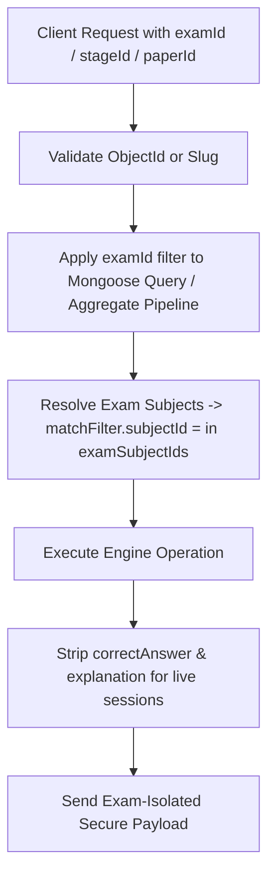

# JPSC & Multi-Exam Backend Architecture Guide

**Platform:** Competitive Examination Preparation Platform  
**Target Exams:** SSC CGL (Tier 1 / Tier 2), JPSC (Prelims Paper 1 / Paper 2, Future Mains)  
**Technology Stack:** Node.js, Express, TypeScript, MongoDB Atlas, Mongoose  

---

## 1. Architectural Philosophy: The Unified Learning Engine

Rather than building duplicate backend codebases or separate services (`jpscPracticeService`, `sscPracticeService`), the application uses a **single, unified learning engine** parametrized by configuration:

```text
                        UNIFIED BACKEND ENGINE
                                  │
         ┌────────────────────────┴────────────────────────┐
         │                                                 │
    [EXAM LAYER]                                     [CORE ENGINES]
    ├── SSC CGL (Tier 1 / Tier 2)                    ├── Adaptive Question Selector
    ├── JPSC (Prelims Paper I & II)                  ├── Mock Test Simulator
    └── Future: BPSC, UPSC, JSSC                     ├── Spaced Repetition Revision
                                                     ├── Daily Study Planner
                                                     └── Performance Analytics
```

### Key Architectural Invariants:
1. **Zero Hardcoded Exam Checks**: Exam behavior (sectional vs. non-sectional mocks, duration, negative marking, question distribution) is driven by database models (`ExamPaper.scoring`, `ExamPaper.durationMinutes`), never by scattered `if (exam === 'JPSC')` conditionals.
2. **Total Query Isolation**: Every content query (subjects, topics, questions, attempts, revisions, daily plans) scopes strictly by `examId`, `stageId`, and `paperId`. SSC and JPSC data never leak across boundaries.
3. **Security Projections**: Practice and Mock test endpoints strictly scrub `correctAnswer` and `explanation` from test payloads. Answers and solutions are returned only upon evaluation.

---

## 2. Relational Hierarchy & Data Models

The database models follow a strict 6-tier hierarchy:

```text
Exam
 └── ExamStage
      └── ExamPaper
           └── Subject
                └── Topic
                     └── Question
```

### 2.1 `Exam` Model (`backend/src/models/Exam.ts`)
Represents the top-level examination authority / competitive exam.

```typescript
interface IExam extends Document {
  name: string;        // e.g. "JPSC", "SSC CGL"
  slug: string;        // e.g. "jpsc", "ssc-cgl" (Unique, Indexed)
  description?: string;
  icon?: string;       // MaterialCommunityIcon identifier
  order: number;       // Display sorting
  isActive: boolean;
  createdAt: Date;
  updatedAt: Date;
}
```

### 2.2 `ExamStage` Model (`backend/src/models/ExamStage.ts`)
Represents examination phases (e.g., Prelims vs. Mains, Tier 1 vs. Tier 2).

```typescript
interface IExamStage extends Document {
  examId: ObjectId;    // Ref: Exam
  name: string;        // e.g. "Prelims", "Tier 1"
  slug: string;        // e.g. "prelims", "tier-1"
  order: number;
  isActive: boolean;
}
// Unique compound index: { examId: 1, slug: 1 }
```

### 2.3 `ExamPaper` Model (`backend/src/models/ExamPaper.ts`)
Represents individual exam papers with scoring, timing, and question quotas.

```typescript
interface IExamPaperScoring {
  correctMarks: number;     // +2 for JPSC & SSC
  wrongMarks: number;       // 0 for JPSC Prelims, -0.5 for SSC Tier 1
  unansweredMarks: number;  // 0
}

interface IExamPaper extends Document {
  examId: ObjectId;         // Ref: Exam
  stageId: ObjectId;        // Ref: ExamStage
  name: string;             // e.g. "Paper I - General Studies", "Paper II - Jharkhand Special"
  slug: string;             // e.g. "paper-1", "paper-2"
  order: number;
  totalQuestions?: number;  // 100 for JPSC
  totalMarks?: number;      // 200 for JPSC
  durationMinutes?: number; // 120 for JPSC
  scoring?: IExamPaperScoring;
  isActive: boolean;
}
// Unique compound index: { stageId: 1, slug: 1 }
```

### 2.4 `Subject` & `Topic` Models
Both models contain references to the exam hierarchy:
- `Subject`: `examId`, `stageId`, `paperId`, `name`, `slug`, `order`, `isActive`.
- `Topic`: `examId`, `stageId`, `paperId`, `subjectId`, `name`, `slug`, `order`, `isActive`.

### 2.5 `Question` Model
Contains the question bank records with provenance and security flags:
```typescript
interface IQuestion extends Document {
  examId?: ObjectId;
  stageId?: ObjectId;
  paperId?: ObjectId;
  subjectId: ObjectId;
  topicId: ObjectId;
  questionText: string;
  optionA: string;
  optionB: string;
  optionC: string;
  optionD: string;
  correctAnswer: 'A' | 'B' | 'C' | 'D';
  explanation: string;
  difficulty: 'Easy' | 'Medium' | 'Hard';
  questionType: 'PYQ' | 'PYQ_INSPIRED' | 'SAMPLE_PAPER' | 'RELATED_PRACTICE' | 'PRACTICE' | 'MODEL' | 'CURRENT_AFFAIRS';
  sourceType: 'OFFICIAL_PYQ' | 'INTERNAL' | 'REFERENCE_BOOK' | 'EXAM_MEMORY' | string;
  sourceYear?: number;
  sourceDate?: Date;
  qaStatus: 'DRAFT' | 'REVIEW' | 'VERIFIED' | 'REJECTED';
  isActive: boolean;
}
```

---

## 3. JPSC Prelims Official Syllabus Mapping

### Paper I: General Studies I (100 Questions / 200 Marks / 120 Minutes)
Scoring: `+2` marks per correct answer, `0` negative marking.

| Category / Subject Slug | Topic Name & Focus Areas | Questions |
| :--- | :--- | :--- |
| `jpsc-history` | Ancient India (Indus, Vedic, Buddhism/Jainism, Mauryas, Guptas) | 5 |
| `jpsc-history` | Medieval India (Delhi Sultanate, Mughals, Bhakti & Sufi) | 5 |
| `jpsc-history` | Modern India (British Expansion, 1857 Revolt, Freedom Struggle) | 5 |
| `jpsc-geography` | General & Physical Geography of India, Rivers & Relief | 6 |
| `jpsc-geography` | Economic, Social & Demographic Geography of India | 4 |
| `jpsc-polity` | Constitution of India & Fundamental Rights | 4 |
| `jpsc-polity` | Public Administration & Good Governance | 4 |
| `jpsc-polity` | Decentralization: Panchayati Raj & Urban Municipalities | 2 |
| `jpsc-economy` | Basic Characteristics of Indian Economy & National Income | 4 |
| `jpsc-economy` | Sustainable Development & Economic Issues | 4 |
| `jpsc-economy` | Economic Reforms, Liberalization & Globalization | 2 |
| `jpsc-science` | General Science (Physics, Chemistry, Life Sciences) | 6 |
| `jpsc-science` | Agriculture & Technology Development in India | 6 |
| `jpsc-science` | Information & Communication Technology (ICT) | 3 |
| `jpsc-p1-jharkhand` | Jharkhand Specific History, Society, Culture & Heritage | 10 |
| `jpsc-current-affairs`| National & International Current Events | 15 |
| `jpsc-misc` | Human Rights, Environment, Sports, Urbanization, Disaster Mgmt | 15 |

---

### Paper II: General Studies II — Jharkhand Special (100 Questions / 200 Marks / 120 Minutes)
Scoring: `+2` marks per correct answer, `0` negative marking.

| Category / Subject Slug | Topic Name & Focus Areas | Questions |
| :--- | :--- | :--- |
| `jharkhand-governance` | Traditional Tribal Governance Systems (Munda, Nagvanshi, Padha Panchayat, Manjhi Pargana, Munda-Manki, Dhoklo Sohor, Jatiya) | 8 |
| `jharkhand-movement` | Sadan, Adivasi Movements, Birsa Munda, Tilka Manjhi, Sidho-Kanho, Statehood Struggle | 7 |
| `jharkhand-identity` | Cultural, Social, Religious & Linguistic Identity of Jharkhand | 5 |
| `jharkhand-culture` | Folk Art, Dances, Traditional Music, Folk Songs, Musical Instruments, Tourist Sites | 5 |
| `jharkhand-literature` | Indigenous Languages, Literary Works, Notable Authors & Scholars | 5 |
| `jharkhand-institutions`| Premier Educational, Technical & Medical Institutions in Jharkhand | 3 |
| `jharkhand-sports` | Indigenous Games, Archery, Hockey, Stadiums, National/International Athletes | 5 |
| **`jharkhand-land-laws`**| **Chota Nagpur Tenancy Act 1908 (CNT Act) (5 Qs)** | 5 |
| **`jharkhand-land-laws`**| **Santhal Parganas Tenancy Act 1949 (SPT Act) (5 Qs)** | 5 |
| **`jharkhand-land-laws`**| **Other State Land Acquisition, Tenancy & Transfer Laws (2 Qs)** | 2 |
| `jharkhand-geography` | Relief, Plateaus, Rivers, Dams, Forests, Climate & Soils of Jharkhand | 10 |
| `jharkhand-industry` | Industrial Policies, Jharkhand Industrial Policy 2001/2012/2016, SEZs | 6 |
| `jharkhand-industries`| Major Heavy & Mineral Industries (TISCO, Bokaro Steel, HEC, Coal/Copper/Uranium) | 5 |
| `jharkhand-schemes` | State Government Welfare Schemes (Birsa Harit Gram, Mukhyamantri schemes) | 5 |
| `jharkhand-forest` | Forest Management, Wildlife Sanctuaries, Betla National Park, Dalma Sanctuary | 5 |
| `jharkhand-environment`| Environmental Protection, Pollution, Climate Action & Disaster Management | 7 |
| `jharkhand-current` | Jharkhand Specific Current Affairs, Appointments & State Awards | 7 |
| `jharkhand-misc` | Miscellaneous Facts & GK of Jharkhand | 7 |

---

## 4. API Endpoints Specification (Phase 3 Completed)

All endpoints maintain 100% backward compatibility with legacy SSC mobile requests while accepting optional multi-exam identifiers (`examId`, `stageId`, `paperId`).

### 4.1 Exam & Hierarchy Discovery
- **`GET /api/exams`**:
  - Returns list of all active exams (e.g. SSC CGL, JPSC) sorted by `order`.
  - Response: `{ success: true, count: number, data: IExam[] }`.
- **`GET /api/exams/:examId/stages`**:
  - Accepts MongoDB `_id` or `slug` (e.g. `/api/exams/ssc-cgl/stages` or `/api/exams/6aa6f.../stages`).
  - Returns active stages for the exam.
- **`GET /api/stages/:stageId/papers`**:
  - Accepts MongoDB `_id` or `slug` (e.g. `/api/stages/tier-1/papers`).
  - Returns active papers for the stage with `scoring`, `durationMinutes`, `totalQuestions`.
- **`GET /api/papers/:paperId/subjects`**:
  - Accepts MongoDB `_id` or `slug`.
  - Returns active subjects mapped to the specified paper.

### 4.2 Content Endpoints (Exam-Scoped)
- **`GET /api/subjects?examId=...&stageId=...&paperId=...`**:
  - Returns active subjects. If `examId` is provided, filters strictly to that exam.
- **`GET /api/subjects/:subjectId/topics?examId=...&stageId=...&paperId=...`**:
  - Accepts subject ObjectId or slug. Returns topics belonging to the subject with optional exam filtering.
- **`GET /api/topics?subjectId=...&examId=...&stageId=...&paperId=...`**:
  - Alternative listing endpoint for topics.

### 4.3 Practice Test Session
- **`POST /api/practice/start`**:
  ```json
  {
    "subjectId": "...",
    "topicId": "...",
    "difficulty": "Medium",
    "count": 25,
    "examId": "...",
    "stageId": "...",
    "paperId": "..."
  }
  ```
  - Adapts to inventory: returns all available questions smoothly even if difficulty has fewer than requested.
  - Security projection: `correctAnswer` and `explanation` are completely omitted.
  - Forward compatible: passes `examId`, `stageId`, `paperId` through question selection.

- **`POST /api/practice/answer`**:
  ```json
  {
    "questionId": "...",
    "userAnswer": "B",
    "timeSpentSeconds": 45,
    "examId": "...",
    "stageId": "...",
    "paperId": "..."
  }
  ```
  - Returns `isCorrect`, `correctAnswer`, step-by-step `explanation`.
  - Records `QuestionAttempt` stamped with `examId`, `stageId`, and `paperId`.

### 4.4 Mock Test Engine
- **`POST /api/mock-tests/start`**:
  ```json
  {
    "testType": "FULL",
    "examId": "...",
    "stageId": "...",
    "paperId": "..."
  }
  ```
  - **Dynamic Configuration**: Inspects `ExamPaper.scoring`, `ExamPaper.durationMinutes`, and syllabus distribution.
  - **Syllabus Distribution Quotas**:
    - **JPSC Paper I (100 Qs)**: History (15), Geography (10), Polity (10), Economy (10), Science & Tech (15), Jharkhand Specific (10), Current Affairs (15), Miscellaneous (15).
    - **JPSC Paper II (100 Qs)**: Tribal Governance (13), Movements & Personalities (13), Land Laws (13), Geography & Rivers (12), Minerals & Industries (13), Welfare Schemes (12), Forest & Wildlife (12), Culture & Sports (12).
    - **SSC Tier-1 (100 Qs)**: 4 sections of 25 questions each (Reasoning, General Awareness, Quantitative Aptitude, English Comprehension).
  - **Navigation & Locking Modes**:
    - Non-sequential exams (JPSC): Free navigation across all 100 questions within the 120-minute window.
    - Sequential exams (SSC CGL): 4 sequential 15-minute sections with forward locking.
  - **Authoritative Scoring Formula**:
    - Calculates `totalScore = (correctCount * correctMarks) + (wrongCount * wrongMarks) + (unansweredCount * unansweredMarks)`.
    - JPSC Prelims: `correctMarks: 2`, `wrongMarks: 0`, `unansweredMarks: 0` -> Pure `Correct * 2` (Max 200, zero penalty).
    - SSC Tier-1: `correctMarks: 2`, `wrongMarks: -0.50`, `unansweredMarks: 0` -> `(Correct * 2) - (Wrong * 0.50)` strictly preserved.
  - **Security Projection**: `correctAnswer` and `explanation` are completely omitted from the active mock payload.

- **`POST /api/mock-tests/answers`**:
  - Saves or updates question answer or review status in real time.

- **`POST /api/mock-tests/:sessionId/submit`**:
  - Authoritatively calculates score, accuracy, section/subject performance, and records attempts.
  - Returns `IMockScoreSummary` with `totalScore`, `maxMarks: 200`, `accuracy`, and `sectionResults`.

- **`GET /api/mock-tests/:sessionId/review`**:
  - **Strict Security Gate**: Accessible only when session status is `COMPLETED`.
  - Reveals official `correctAnswer`, user's choice, step-by-step `explanation`, and dynamically computed `marksAwarded` (`+2` for correct, `0` for wrong in JPSC; `+2 / -0.50` in SSC).

- **`GET /api/mock-tests/marked-questions?examId=...`**:
  - Scopes marked questions to the specified exam.

### 4.5 Analytics, Revision & Daily Plan Endpoints
- **`GET /api/performance` & `GET /api/performance/summary`**:
  - Query parameter: `?examId=...` (or `?examSlug=...`)
  - **Subject-ID Scoped Attempt Aggregation**: Legacy `QuestionAttempt` records may possess `null` or missing `examId` attributes. To guarantee mathematical isolation, the backend queries active exam subjects first (`Subject.find({ examId: examObjId, isActive: true })`), and scopes attempt aggregation strictly by:
    ```typescript
    matchFilter.subjectId = { $in: examSubjectIds };
    ```
  - **Subject Breakdown Isolation**: Only subjects belonging to the active exam are populated in `subjectStatsMap` and returned in the `subjects` array. Topics and subject metrics from other exams are strictly ignored during aggregation.
  - Returns: `totalAttempted`, `totalCorrect`, `totalWrong`, `overallAccuracy`, `difficulty`, `weakTopics` (sorted by `priorityScore` descending), and `subjects` breakdown array.
- **`GET /api/performance/recommendations`**:
  - Query parameter: `?examId=...` (or `?examSlug=...`)
  - Calls `getRecommendedPractice(userId, limit, examId)`.
  - Dynamically detects the target exam and returns high-yield starter recommendations for the exam's specific subjects/topics rather than defaulting to hardcoded SSC topics.
- **`GET /api/revision` & `GET /api/revision/summary`**:
  - Query parameter: `?examId=...`
  - Returns mistake counts and spaced repetition statistics isolated by exam.
- **`GET /api/revision/due?examId=...`**:
  - Returns due flashcard/spaced-repetition questions for the given exam.
- **`GET /api/study-plan/today?examId=...`**:
  - Generates or retrieves daily study recommendations strictly for the active exam.
- **`POST /api/study-plan/generate`**:
  - Body / Query: `{ examId: "..." }`
  - Generates a fresh study plan for the given exam without overwriting another exam's plan.

---

## 5. Security & Isolation Checkpoints



1. **Anti-Leakage Guarantee**: A MongoDB filter with `{ examId: targetExam._id }` and `{ subjectId: { $in: examSubjectIds } }` is enforced across:
   - Question selection (`questionSelectionService.ts`)
   - Attempt history & performance aggregations (`performanceService.ts`)
   - Spaced repetition revisions & mistakes (`revisionService.ts`)
   - Daily study recommendations (`dailyStudyPlanService.ts`)
   - Mock test generation (`mockTestService.ts`)
2. **Slug & ID Dual-Resolution**: All endpoints accept both `examId` (MongoDB ObjectId) and human-readable `examSlug` (`jpsc`, `ssc-cgl`). If `examSlug` is provided, controllers dynamically resolve the matching `Exam` document and enforce `{ examId: exam._id }` in all Mongoose queries and aggregation pipelines.
3. **Scoring Isolation**: Score calculation dynamically loads `ExamPaper.scoring` configuration, preventing SSC negative marking rules (`-0.50`) from affecting JPSC sessions (`0`), and vice versa.
4. **Automated Verification**:
   - Multi-Exam Mock Engine Suite (`backend/src/scripts/testJPSCMockEngine.ts`): **36 / 36 tests passing** verifying cross-exam question isolation, JPSC scoring (+2/0), SSC scoring (+2/-0.50), and security projections.
   - Isolation Performance Suite (`backend/src/scripts/testIsolationPerformance.ts`): Verifies SSC attempted counts (92) vs JPSC attempted counts (14) with zero subject/metric cross-contamination.
   - Full Backend Regression Suite (`npm test`): **404 / 404 tests passing across all 9 automated test suites**.

---

## 6. Extending the Platform to Future Exams (BPSC, UPSC, JSSC)

The backend is completely modular and database-driven:

```text
               ADD NEW EXAM FLOW (Zero Backend Code Change)
                                    │
                       1. Seed Exam in MongoDB
                 { name: "BPSC", slug: "bpsc", icon: "school" }
                                    │
                       2. Seed Stages & Papers
                 { stage: "prelims", paper: "general-studies" }
                                    │
                       3. Ingest Subjects, Topics & Questions
                 { examId: bpsc._id, paperId: paper._id, ... }
                                    │
                                    ▼
       All existing endpoints automatically support ?examSlug=bpsc:
       - GET /api/subjects?examSlug=bpsc
       - GET /api/topics?examSlug=bpsc
       - GET /api/mock/generate?examSlug=bpsc
       - GET /api/performance/overview?examSlug=bpsc
       - GET /api/revision/due?examSlug=bpsc
       - GET /api/study-plan/daily?examSlug=bpsc
```

No additional routes, microservices, or database collections are required. The single unified learning engine powers all exams concurrently.

---

## 8. Bilingual Engine Architecture (English & Hindi)

### 8.1 Schema Design
To provide authentic bilingual question papers (standard in SSC CGL & JPSC) with 100% backward compatibility and zero database migration breakage, companion localized fields are attached to the `Question` document model:

```typescript
export interface IQuestion extends Document {
  // English Baseline (Required)
  questionText: string;
  optionA: string;
  optionB: string;
  optionC: string;
  optionD: string;
  explanation: string;

  // Hindi Translations (Optional Companion Fields)
  questionText_hi?: string;
  optionA_hi?: string;
  optionB_hi?: string;
  optionC_hi?: string;
  optionD_hi?: string;
  explanation_hi?: string;
}
```

### 8.2 Projection & Security Isolation
- **Practice Drills (`practiceService.ts`)**: `evaluateAnswer` delivers `explanation_hi` alongside `explanation` only upon user answer submission.
- **Mock Tests (`mockTestService.ts`)**: Questions delivered during live test sessions (`ISanitizedMockQuestion`) expose `questionText_hi` and `optionA_hi`...`optionD_hi` while strictly concealing `correctAnswer` and `explanation_hi`. During post-exam review (`getMockTestReview`), `explanation_hi` is fully exposed for in-depth step-by-step revision.
- **Marked Questions Review (`getMarkedQuestionsForReview`)**: Includes all `_hi` fields so aspirants can review saved questions in their preferred language.


